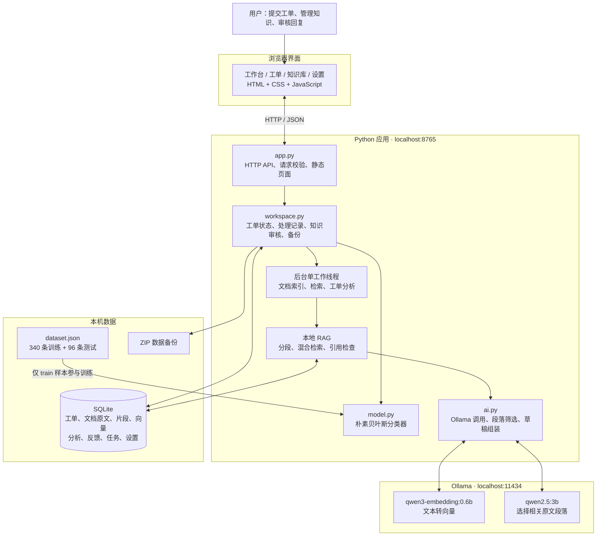
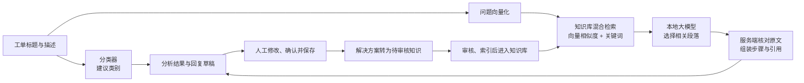

# Desk · 本地 AI 工单工作台 v0.2

从原 `ai-ticket-demo` 升级而来。面向个人、本机使用的中文 IT 工单工作台：工单管理 → 本地知识检索 → 带原文引用的回复草稿 → 人工解决 → 审核后的知识积累。原始朴素贝叶斯 Demo 和评估 API 保留在 `/classic`。

## 启动

项目位置：`/Users/wenbiaoli/develop/agent/ai-ticket-demo`

```bash
cd /Users/wenbiaoli/develop/agent/ai-ticket-demo
.venv/bin/python app.py
```

打开 http://127.0.0.1:8765 。也可双击 `启动工作台.command`。Ctrl+C 正常关闭工作台；进行中的后台任务会完成后再退出。Ollama 是独立服务，停止工作台不会停止其他应用可能共用的 Ollama。

首次安装依赖（已在本次开发时安装）：

```bash
python3 -m venv .venv
.venv/bin/python -m pip install -r requirements.txt
```

仅依赖一个第三方 Python 库 `pypdf`，用于文本型 PDF。Python 3.10+，macOS/Linux，模型运行使用 Ollama。业务服务与界面不依赖 Node 构建或 CDN。

## 本地模型

默认配置：

- 服务：`http://127.0.0.1:11434`
- 生成：`qwen2.5:3b`
- embedding：`qwen3-embedding:0.6b`，实测1024维

```bash
OLLAMA_NO_CLOUD=1 ollama serve
ollama pull qwen2.5:3b
ollama pull qwen3-embedding:0.6b
```

模型下载需要联网，之后问答只调用本机服务。应用拒绝远程模型地址与含 `cloud` 的模型名称，不会自动回退到云端推理。本次已安装上述两个模型。设置页支持更换本地模型、列出已安装模型和实测 embedding/生成连接。

模型离线时仍能管理工单、查看资料、写处理记录；文档降级为关键词检索并明确标记。模型恢复后点击文档“重新索引”。更换向量模型或服务地址会清空旧向量，必须重新索引。

## 使用流程

1. 在工作台点击“载入示例数据”，得到4条示例工单和4份演示指南。每条示例都有标识；示例资料不代表真实组织政策，可分别删除。
2. 在知识库导入 Markdown、UTF-8 TXT、文本型 PDF，或直接编写知识条目。单份5MB以内、最多200页、提取文字最多50万字。不支持扫描 OCR 或加密 PDF。
3. 新建工单，填写问题、提交人、类别与优先级。类别可由原分类器初步建议，也可人工指定。
4. 点击“开始分析”。后台检索知识，生成摘要、补充信息、排查步骤和回复草稿。点击引用查看原文片段；PDF 引用保留页码。
5. 人工核对后使用或修改草稿，填写实际解决方案并保存。回复仅保存在本地，不自动发送。
6. 标记为“已解决”后，可“沉淀为知识”。条目先进入待审核队列，经审核发布后才参与后续检索。

状态支持待处理、处理中、已解决、已关闭和重新打开。关闭前必须先解决；解决或关闭时必须有解决方案。删除工单会删除其处理记录，独立保存的知识条目保留。

## 数据和备份

- 默认数据库：`data/workspace.sqlite3`。
- 工单、处理时间线、文档原件、解析文字、向量、引用快照和反馈都保存在该数据库中。
- `data/`、`.venv/`、`.backups/` 不提交 Git。
- “设置 → 创建并下载备份”通过 SQLite 在线备份生成一致性快照，并附带 SHA-256 校验。
- 更新文档立即停用旧版本片段；后台索引完成后一次性发布新版本。失败时旧索引不回流，界面显示失败原因。
- 文档更新或删除后，历史分析保留当时的引用快照，但标记失效并禁止直接采纳；历史快照不是当前可检索知识。

恢复时先关闭工作台，然后运行：

```bash
.venv/bin/python app.py --restore /absolute/path/desk-backup-xxx.zip
.venv/bin/python app.py
```

恢复过程检查备份格式、校验和、数据库完整性和版本，恢复前自动保留当前数据库副本。进程锁阻止运行中的数据目录被第二个实例或恢复命令修改。可以先在独立目录试恢复：

```bash
.venv/bin/python app.py --data-dir /tmp/desk-restore-check --restore /absolute/path/backup.zip
.venv/bin/python app.py --data-dir /tmp/desk-restore-check --port 8767
```

## 验证

```bash
.venv/bin/python -m unittest discover -v
node --check static/app.js
# 真实本机 Ollama + 临时隔离数据 + HTTP 验收，需模型服务在线：
.venv/bin/python tests/acceptance.py /tmp/desk-acceptance.json
# 原版分类器评估：
.venv/bin/python app.py --evaluate
```

单元/集成测试用可控的假模型验证流程、事务、引用失效和错误处理，不用它证明模型效果。`tests/acceptance.py` 使用真实模型验证 RAG、审核入库、备份恢复和接口访问控制。测试数据与正式数据隔离。

## 架构图

当前采用本地单体架构：浏览器提供界面，Python 应用负责业务流程，SQLite 保存业务数据和向量，独立运行的 Ollama 提供本地模型能力。



### 工单分析与知识积累



上图展示模型可用且检索到相关知识的主要路径；向量模型不可用时降级为关键词检索，生成模型不可用或证据不足时交由人工继续处理。

- **分类训练数据**回答“这是什么问题”。当前为账号与认证、权限与访问、支付与账单、网络与连接、应用与数据故障、功能与改进需求六个学习类别，另设待人工分类。测试样本只用于评估，不参与训练。
- **RAG 知识库**提供可参考的处理办法，通过文档导入和解决方案审核扩充；不会自动训练分类器。
- **本地大模型**选择相关指引，由服务端使用原文组装草稿；当前未微调大模型。
- **向量存储**使用 SQLite，由 Python 进行精确相似度计算，没有独立向量数据库服务。

## 实现说明

- `app.py`：本机 HTTP 服务、接口、旧版兼容入口、启动与恢复命令。
- `workspace.py`：SQLite、工单流转、文档后台任务、RAG 组织、备份恢复。
- `ai.py`：本地 Ollama 适配、向量相似度与关键词混合检索、结构化回答检查。
- `static/`、`index.html`：响应式原生 JavaScript 工作台，无远程资源。
- `model.py`、`dataset.json`：保留原教学分类器与训练样本。
- `sample-docs/`：可选的演示知识，不是现实企业政策。

向量保存在 SQLite 中，以精确余弦相似度扫描结合中文二元词片段/英文词的关键词重合度检索。这是面向小型个人知识库的本地向量存储，尚未引入 ANN 向量引擎。大规模语料需要另行压测和迁移。

## 已知边界

- 本机单用户应用；无多人权限、邮件或聊天平台接入、自动执行修复、自动发送回复。
- 工单列表每次最多返回500条，支持搜索/类别/状态筛选。
- 分类与优先级建议为教学模型/启发式，不是校准后的业务风险判定。
- RAG 检索阈值为初始启发式。高相关度不代表正确率；证据不足时降级，但不能保证模型绝不编造。
- 本地模型选择相关段落编号，服务器从原文取回完整段落并组装回复；不使用模型自由改写的处理步骤。摘要保留工单标题，避免编造用户已执行的动作。编号、版本、来源可用性均受检查，但资料本身是否准确以及建议是否适用仍需人工核实。
- 相似工单使用关键词关联作为独立参考，只有审核发布的方案才加入正式 RAG 知识库。
- 后台导入和分析单队列执行；首次加载模型可能较慢。异常退出后未完成任务会标记失败，需要重试。
- 备份含原始文档及工单内容，文件由本机用户自行保管；应用不加密数据库。

接口依据：[Ollama embed](https://docs.ollama.com/api/embed)、[Ollama chat](https://docs.ollama.com/api/chat)。功能参考 AgentDesk、RAG-Based Intelligent Support Ticket System 和 KAI 的公开产品设计；未复制其源码。

## 六类分类升级

分类数据现有 436 条合成工单：340 条训练、96 条测试。账号认证与访问授权、网络连接与应用故障分别建类；请求新增能力归功能与改进需求。低置信度工单进入待人工分类。

旧数据库首次加载时自动备份并迁移分类。旧账号登录及系统故障均包含新分类的多个分支，保守迁移为待人工分类；支付账单与功能需求直接更名，其他转为待人工分类。迁移增加版本并保留时间线，旧分析失效；再次启动不会重复迁移。旧客户端提交的类别采用相同兼容规则。

详细样本分布和评估限制见 [训练数据说明](docs/training-data.md)。

## 界面主题

工作台采用明亮的浅蓝立体主题：白色浮层卡片、橙色主操作按钮、柔和渐变和短暂入场动画。工单、知识库、详情、设置和弹窗共用主题。宽屏首页使用主内容与知识侧栏，窄屏自动堆叠；数据均来自现有 API。

卡片支持悬停抬升，按钮具有按压反馈，AI 图标仅短时浮动。系统开启“减少动态效果”时停用动画。主题位于 static/style.css，首页布局位于 static/app.js；不依赖外部动画库或 CDN。

## 分支整合

整合 feature/add-new-logic 的本地 RAG 工作台与该分支 stash 中的六类迁移、立体主题及格式化修改，保留当前 436 条分类数据（340 训练、96 测试）。当前分类器页面保留在 /classic；历史 stash 未删除。模型评估以 evaluation.json 和 /api/report 为准。

## 工单导出

工单列表支持“导出筛选结果”，按已应用的关键词、状态和类别下载完整 CSV，不受页面 500 条上限影响。修改筛选框后先点击“筛选”，再导出。无匹配结果会提示清除筛选；CSV 无匹配时仍保留表头。

导出含编号、标题、描述、类别、优先级、状态、提交人、回复、解决方案及 UTC 时间。采用 UTF-8 BOM，兼容中文表格读取；可能被表格软件解释为公式的文本会加单引号。CSV 用于查看和分析，不替代完整数据库备份，也不提供回导。

接口：`GET /api/tickets/export?q=关键词&status=状态&category=类别`。当前以本地小规模工作台为目标，导出在内存生成，尚未验证超大数据集容量。

下一步建议优先补充：工单分页及总数、人工分类反馈审核入训练集、独立真实业务评估集。多人权限及外部渠道接入需另行明确使用场景。
